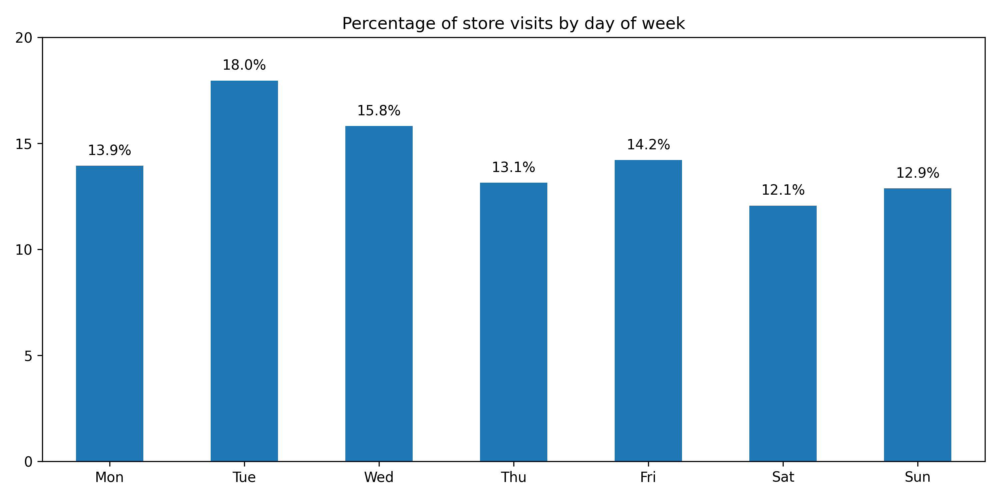
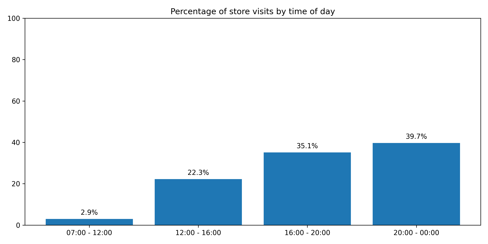
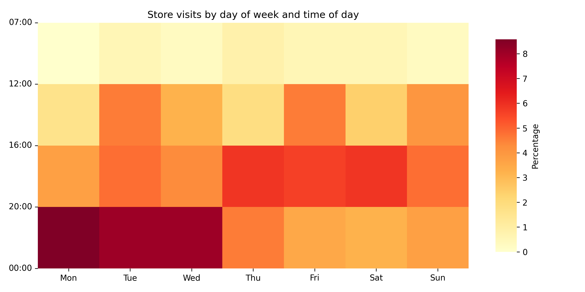
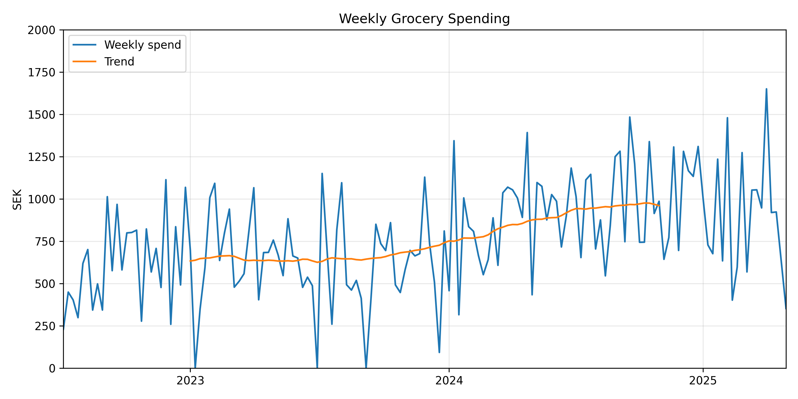
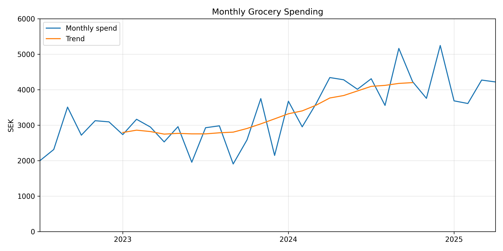
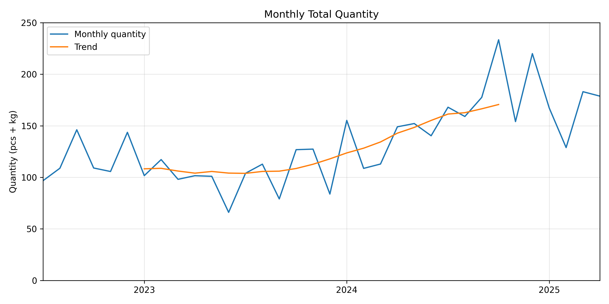
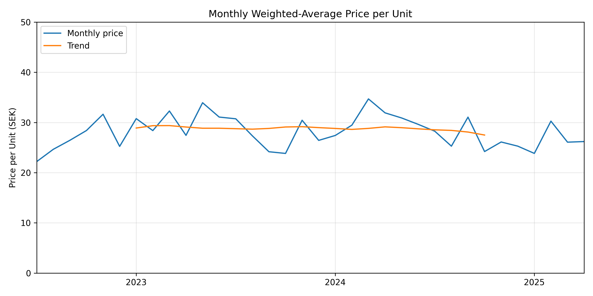
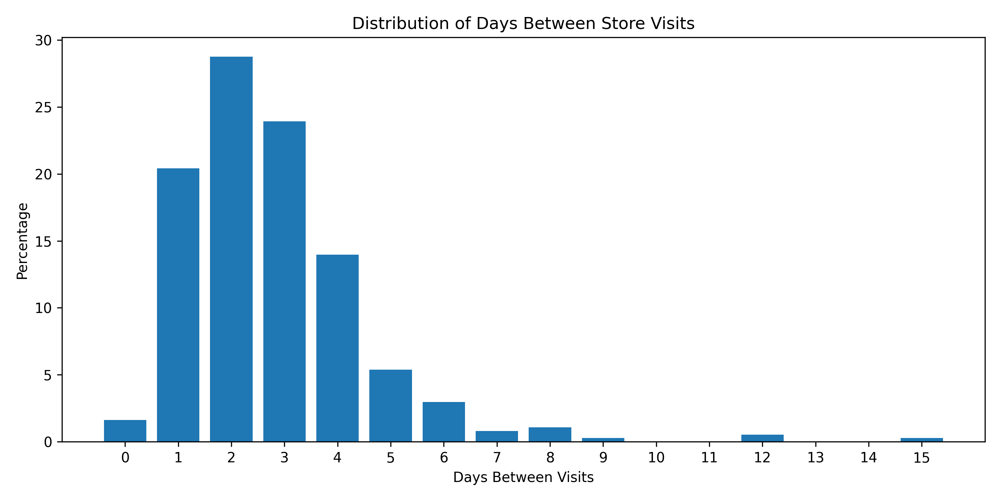
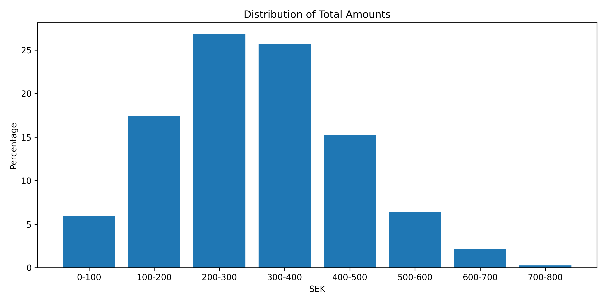
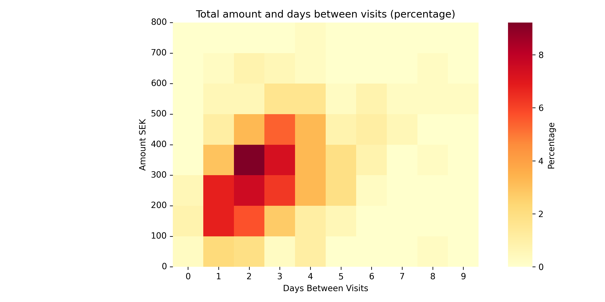

# Grocery Spend EDA

Exploratory Data Analysis of my personal grocery spend data for the past ~3 years.

## Process

Every purchase I make at an ICA store sends the receipt to the Kivra app, where you can download each individual receipt as a pdf. I downloaded all of my receipts and made a parser that creates two dataframes, one for each receipt itself, and one for all of the purchased items in the receipts.

#### receipts_df:

| receipt_id | store | datetime | total_amount |
| ---------- | ----- | -------- | ------------ |

#### products_df:

| receipt_id | article_name | article_number | price_per_unit | quantity | unit | total_price |
| ---------- | ------------ | -------------- | -------------- | -------- | ---- | ----------- |

## Findings

Over the last two years my monthly average spending has increased by over 1000 SEK (33%). Looking at the quantity during this time suggests that I am simply buying more, as it also increased in a similar fashion and the weighted average price has remained fairly constant.

## Graphs

