# Grocery Spend EDA

Exploratory Data Analysis of my personal grocery spending over the past three years.

## Overview

This project analyzes all my grocery purchases from ICA stores using receipt data collected via the Kivra app. It includes data extraction, preprocessing, exploratory analysis in Python, and interactive dashboards created in Power BI.

## Data Collection

Every purchase I make at an ICA store sends a receipt to the Kivra app. These receipts are downloadable as PDFs. I built a custom parser to extract data from these receipts into two structured DataFrames:

#### receipts_df:

| receipt_number | datetime |
| -------------- | -------- |

#### products_df:

| receipt_number | item_name | item_id | unit_price | quantity | unit | pre_discount_sum |
| -------------- | --------- | ------- | ---------- | -------- | ---- | ---------------- |

## Process

1. Data Extraction: Receipt PDFs were parsed into structured tabular data.

2. Initial EDA: Conducted in Python using pandas, matplotlib, and seaborn.

3. Modeling & Dashboards: Data was normalized and imported into Power BI for further analysis and dashboard creation.

## Key Findings

- Monthly Spend Increase: Over the last two years, my average monthly spend increased by more than 1000 SEK (approx. 33%).
- Quantity vs. Price: The increased spend is mostly due to buying more items. The weighted average price has remained relatively stable.

## Power BI Dashboards

### Visits

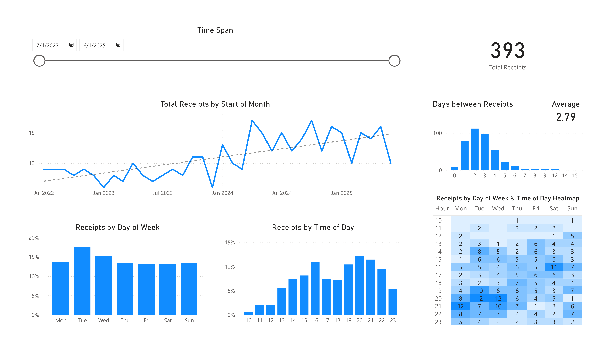

### Spending

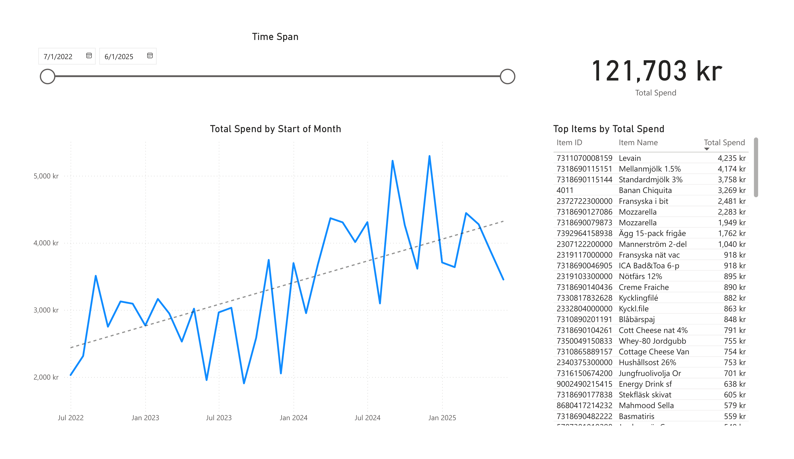

### Quantity

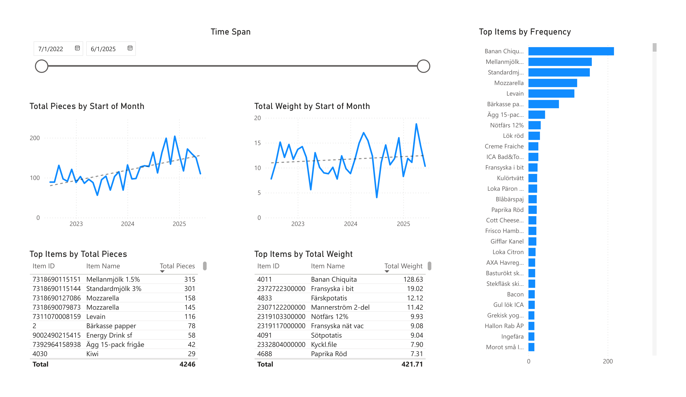

## Python Graphs

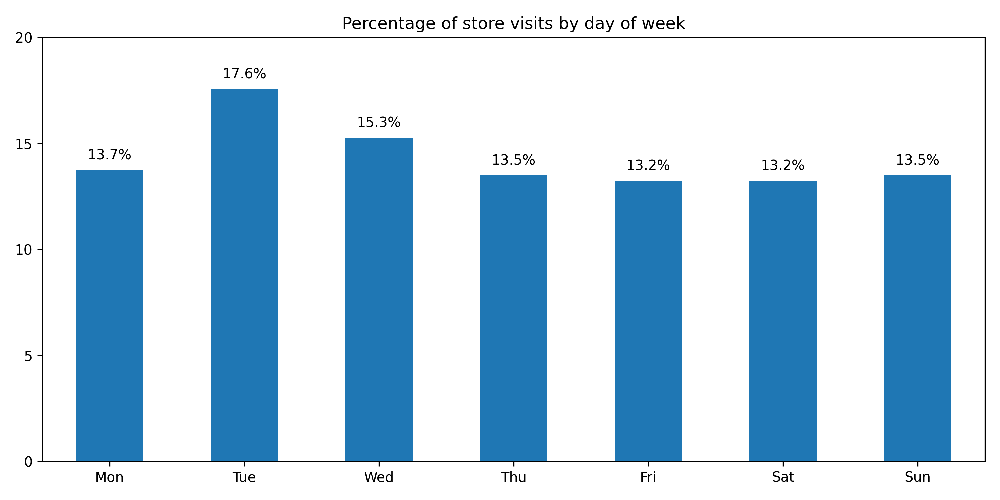

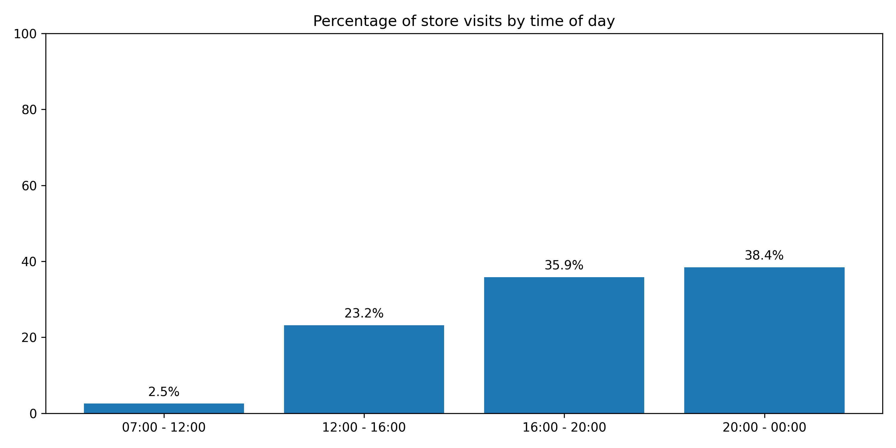

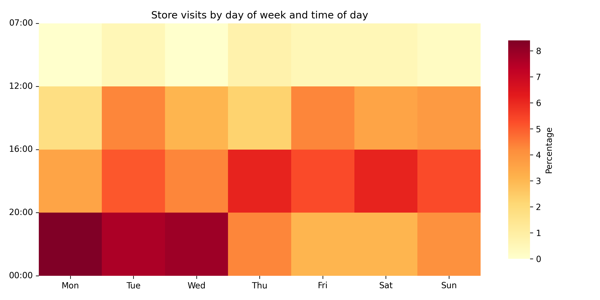

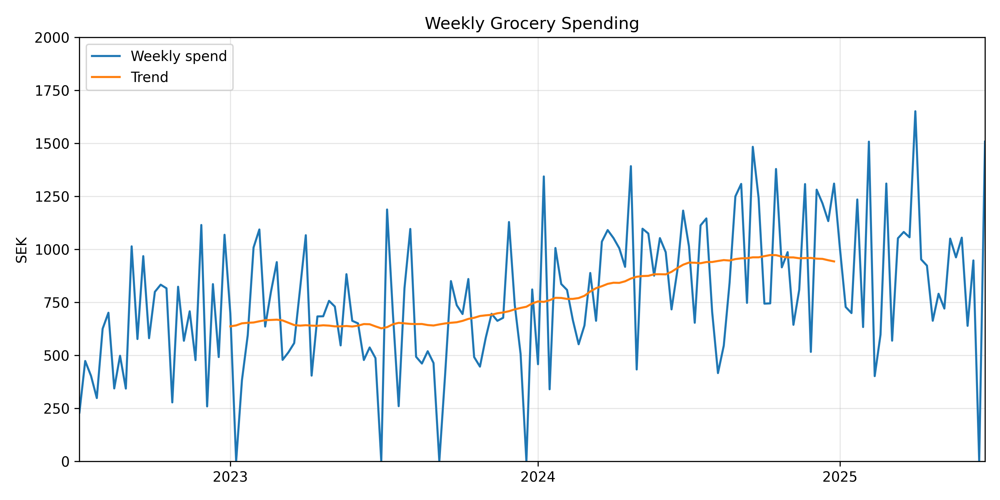

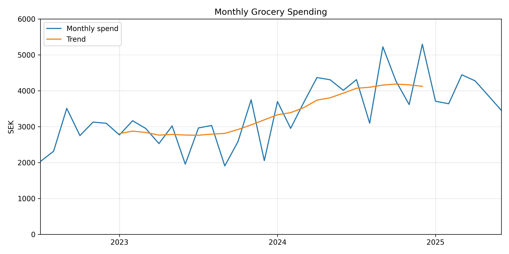

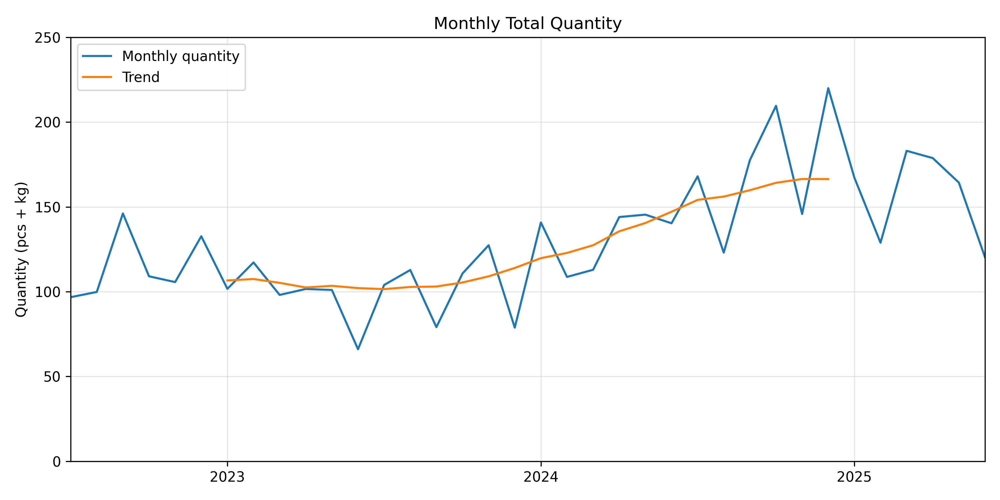

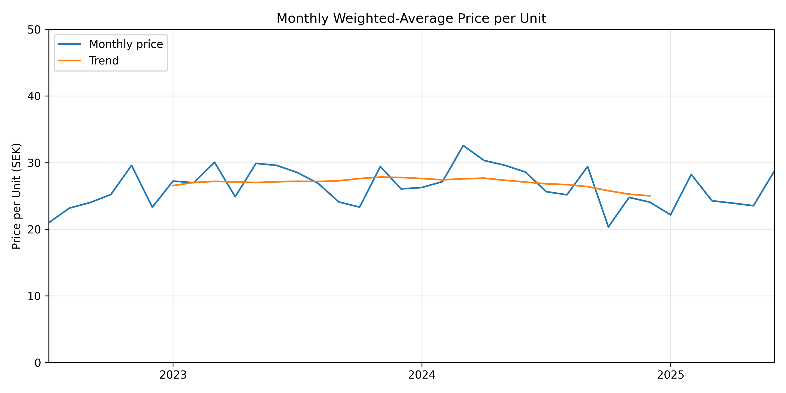

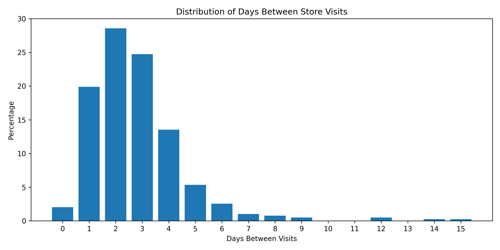

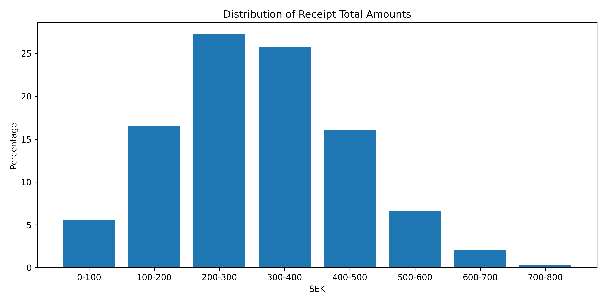

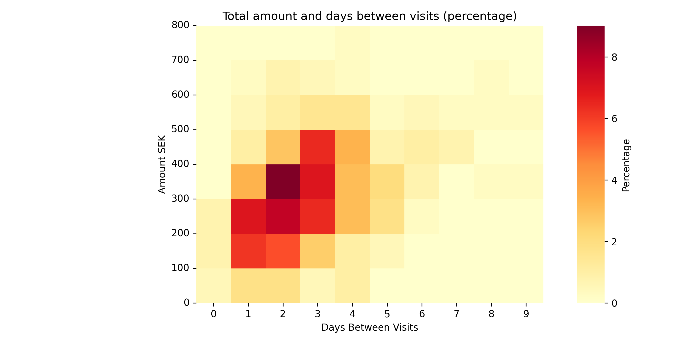